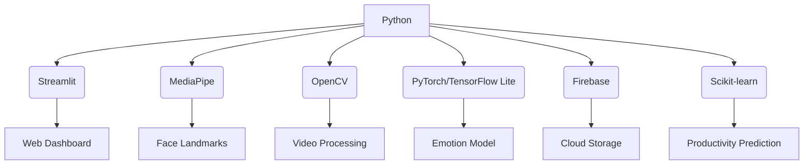

# 🧠 Cognify – AI Productivity & Wellness Dashboard

**Real-time AI dashboard that tracks your emotions, detects fatigue, and visualizes productivity patterns.** 🚀

> *"Understanding your mind is the first step to optimizing your potential."*


## 🌟 Overview

Cognify is an AI-powered system that helps individuals and teams monitor their **emotions, fatigue levels, and productivity trends** in real time.

Unlike traditional productivity tools that only measure activity, Cognify looks deeper into your **cognitive state** using facial expressions, fatigue detection (blinks, yawns, eye closure), and emotion confidence scores.

With smart alerts, focus timers, and session reports, Cognify bridges the gap between **wellbeing and performance**.

---

## ✨ Key Features

### 🎯 Real-time AI Insights

* Detects **7 emotions** with uncertainty quantification.
* Tracks **fatigue** via eye aspect ratio (EAR), mouth aspect ratio (MAR), PERCLOS, and yawns.
* Computes a **productivity score (1–5)** by fusing emotion + fatigue metrics.

### ⏰ Smart Focus Tools

* Integrated **Pomodoro Timer** for deep work.
* **Peak focus & fatigue alerts** in real time.
* Automatic **session reports** with export options.

### 📊 Personal Analytics

* Long-term **trend analysis** by day/week.
* Insights on **peak performance times**.
* Identifies **fatigue patterns** to optimize schedules.

### ☁️ Cloud Integration (Optional)

* Secure **Firebase login (Email/Google)**.
* Cloud storage for session logs.
* Cross-device access and sync.

---

## 🛠 Tech Stack



**Core Libraries**:

* `Streamlit` – web UI
* `MediaPipe` – face mesh & landmarks
* `OpenCV` – video processing
* `PyTorch / TFLite` – AI models
* `Firebase` – authentication & storage
* `Scikit-learn` – productivity modeling

---

## 🚀 Getting Started

### 1. Prerequisites

* Python 3.8+
* Webcam
* (Optional) Microphone for future voice analysis

### 2. Installation

```bash
git clone https://github.com/itripathiharsh/Cognify.git
cd Cognify

python -m venv venv
source venv/bin/activate   # On Windows: venv\Scripts\activate

pip install -r requirements.txt
```

### 3. Run the App

```bash
streamlit run src/app/app.py
```

(Optional Firebase setup available in docs for cloud features.)

---

## 🎮 Usage Guide

1. **Login / Signup** → Secure login via Firebase.
2. **Calibration** → 20s neutral face baseline setup.
3. **Tracking** → Start webcam to monitor emotion, fatigue, and productivity.
4. **Focus Sessions** → Use 25-min Pomodoro cycles with real-time analysis.
5. **Reports** → Export detailed session analytics & trends.

---

## 📊 Example Metrics

```
🎯 Emotion Confidence: 91%  
👁️ Eye Aspect Ratio: 0.27  
👄 Mouth Aspect Ratio: 0.35  
💤 Fatigue Index: 0.21  
😊 Valence (Mood): 0.62  
⚡ Arousal (Energy): 0.49  
📊 Productivity Score: 4.3 / 5  
```

---

## 🔧 Project Structure

```
Cognify/
├── src/
│   ├── app/          # Streamlit interface
│   ├── uncertainty/  # Emotion uncertainty modules
│   ├── fatigue/      # EAR, MAR, PERCLOS, fatigue index
│   ├── product/      # Productivity scoring models
│   └── audio/        # Voice stress analysis (future)
├── models/           # Pretrained models
├── data_log/         # Session logs
├── requirements.txt
└── README.md
```

---

## 🎓 Research Value

Cognify integrates established HCI and affective computing concepts:

* **Monte Carlo Dropout** → quantifies uncertainty in emotion recognition.
* **PERCLOS & EAR/MAR** → fatigue detection (eye/mouth metrics).
* **Valence-Arousal mapping** → continuous emotion analysis.
* **Multimodal fusion** → combining affect + fatigue into productivity.

Applications:

* Human-computer interaction (HCI) studies.
* Productivity and wellness research.
* Cognitive workload monitoring.

---

## 🚀 Future Roadmap

* 🔊 **Voice Stress Analysis** – tone-based stress detection.
* 📱 **Mobile App** – offline + push notifications.
* 👥 **Team Analytics** – collaborative dashboards.
* 🧠 **Personalized ML Models** – adaptive productivity predictions.

---

## 🤝 Contributing

1. Fork the repo
2. Create feature branch: `git checkout -b feature/AmazingFeature`
3. Commit changes: `git commit -m "Add feature"`
4. Push: `git push origin feature/AmazingFeature`
5. Open PR 🚀

---

## 📄 License

Licensed under the MIT License. See [LICENSE](LICENSE) for details.

---

## 🙏 Acknowledgments

* [MediaPipe](https://mediapipe.dev/) – facial landmarks
* [Streamlit](https://streamlit.io/) – UI framework
* [Firebase](https://firebase.google.com/) – authentication & cloud
* Academic research on **emotion recognition & fatigue detection**

---

